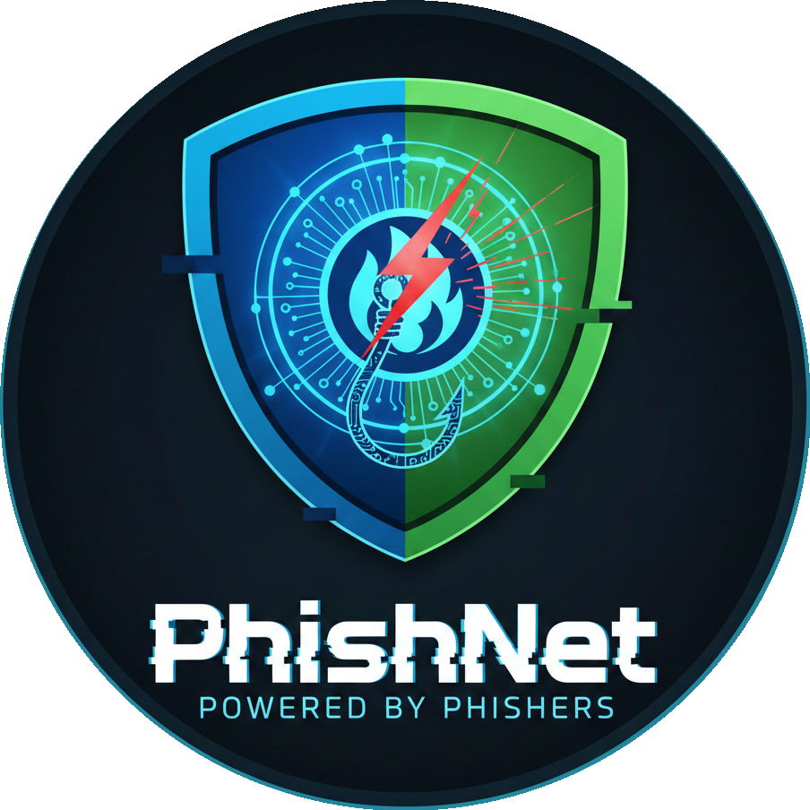
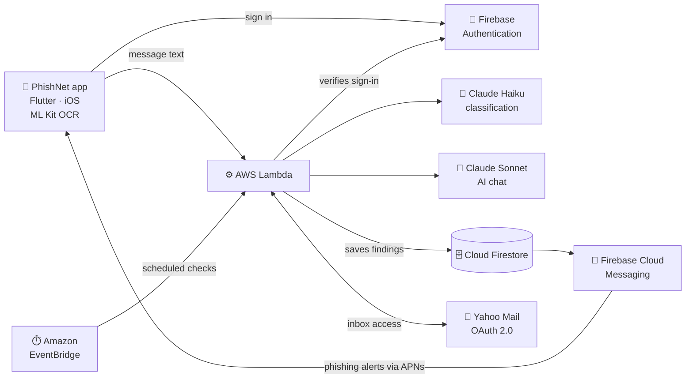

<p align="center">
  
</p>

<h1 align="center">PhishNet</h1>

<p align="center"><strong>A clearer, calmer way to navigate suspicious messages.</strong></p>

<p align="center">
  A student-led project built by the <strong>Phishers</strong><br>
  to help older adults and people less comfortable with technology stay safe from scams.
</p>

<p align="center">
  
  
  
  
  
  
</p>

<p align="center">
  <a href="#-our-mission">Mission</a> ·
  <a href="#-the-problem">Problem</a> ·
  <a href="#-how-phishnet-helps">Solution</a> ·
  <a href="#-project-status">Status</a> ·
  <a href="#-roadmap">Roadmap</a> ·
  <a href="#-infrastructure">Infrastructure</a> ·
  <a href="#-get-started">Get started</a>
</p>

---

## 🎯 Our mission

> **Everyone deserves to feel safe online, no matter their age or how
> comfortable they are with technology.**
>
> PhishNet exists to replace fear and confusion with clear explanations and
> confident next steps, so no one has to face a suspicious message alone.

---

## 🚨 The problem

Scam and phishing messages are getting more convincing every year, and the
people hit hardest are often **older adults and people less comfortable with
technology**. A fake bank alert or "package delivery" text can look completely
real, and the tools meant to help usually respond with jargon, warnings, and
technical terms that add to the stress.

The result is a hard choice: click and risk it, or ignore a message that might
have been real.

---

## 💡 How PhishNet helps

PhishNet is an iOS app that puts **plain-language explanations and practical
next steps ahead of technical jargon**. It is built to feel calm, clear, and
respectful, never rushed or condescending.

| Step | What you do | What PhishNet gives you |
| --- | --- | --- |
| **1. Share** | Paste a message, or select a screenshot, on the **Capture** screen. | Text is read from screenshots right on your phone, so the image never needs to be uploaded. |
| **2. Understand** | Read the **Results** screen. | A plain-language breakdown of the warning signs, with no technical terms. |
| **3. Decide** | Ask a follow-up in **AI Chat** if you are unsure. | Clear, practical next steps, plus detailed explanations on request. |

**Looking out for each other.** PhishNet will also keep a **History** of your
past scans, offer optional Yahoo inbox monitoring with alerts, and include a
**Family/Social** screen so loved ones can help each other spot scams.

> [!NOTE]
> PhishNet is designed to support informed decisions. It does not replace your
> judgment, and it cannot guarantee that every scam will be identified.

---

## 🚦 Project status

PhishNet is **in active development**. The roadmap describes planned
milestones, not features that are available today.

| ✅ Built so far | 🛠️ Planned |
| --- | --- |
| Firebase Email/Password authentication | Capture and Results screens connected to Claude scam analysis |
| Signup validation for Gmail and Yahoo addresses | AI Chat for follow-up questions |
| Email verification and verified-account login checks | History of saved scans and a Home dashboard |
| Password reset by email | On-device screenshot text recognition |
| Guest access to the capture flow | Yahoo inbox monitoring and push alerts |
| Screen foundations: capture, results, AI chat, family/social, history, settings, and payment plans | Family/Social sharing and scam-pattern insights |
| Shared, accessible styling across the app | Payment-plan backend |

Follow day-to-day progress on the
**[GitHub project board](https://github.com/users/Shiv05-code/projects/2)**.

---

## 🗺️ Roadmap

The team is working in **four two-week sprints**. Dates are planned sprint
windows and scheduled demos, and may change as work progresses.

| Sprint | Window | Demo | Goal |
| --- | --- | --- | --- |
| **1 · Foundations** | Sep 30 – Oct 14, 2026 | Oct 21 | Accessible sign-in and account management, navigation and Settings, Payment Plans experience, Firebase and Claude prepared |
| **2 · Message checking** | Oct 15 – Oct 28, 2026 | Nov 4 | Capture and Results screens connected to Claude scam analysis, AI Chat, Yahoo monitoring setup begins |
| **3 · Monitoring and history** | Oct 29 – Nov 11, 2026 | Nov 18 | History and Home dashboard, Yahoo monitoring with alerts, screenshot text recognition |
| **4 · Sharing and polish** | Nov 12 – Nov 25, 2026 | Dec 2 (final demo) | Family/Social sharing, saved AI Chat conversations, scam-pattern insights, Payment Plans improvements |

<details>
<summary><strong>What each sprint delivers</strong></summary>

<br>

**Sprint 1 — Foundations**
- Sign-in, sign-up, verification, password recovery, account settings, and account deletion
- Accessible navigation (Home and Menu) and legal-information screens (Terms & Conditions and Privacy Policy)
- Firebase data services and Claude API integration prepared for Sprint 2
- Payment Plans interface and supporting setup

**Sprint 2 — Message checking**
- Capture screen and Results screen connected to Claude-powered scam analysis
- Claude integrated into the AI Chat experience
- AWS setup begins for Yahoo email monitoring

**Sprint 3 — Monitoring and history**
- History screen with saved scans and recent detections
- Home dashboard with analytics
- Yahoo authorization and scheduled inbox monitoring, with notifications for flagged messages
- On-device OCR on the Capture screen so users can check text in screenshots

**Sprint 4 — Sharing and polish**
- Family/Social screen with sharing through the iOS Share Sheet
- Saved AI Chat conversations and recurring scam-pattern insights
- Payment Plans backend improvements and final feature polish

</details>

---

## 🏗️ Infrastructure

PhishNet is an iOS-focused Flutter app backed by Firebase, AWS, and Claude.
**Firebase Authentication is integrated today; every other backend service
below is planned.**



### Frontend

| Tool | Purpose |
| --- | --- |
| **Flutter and Dart** | The iOS-focused mobile app |
| **Xcode and iOS Simulator** | iOS development and visual testing |
| **Google ML Kit** | On-device text recognition, so screenshots are read without being uploaded |
| **iOS Share Sheet** | Family and social sharing |
| **Figma, SF Symbols, Google Fonts** | Design, icons, and typography |
| **Apple Developer Account** | TestFlight and App Store distribution |

### Backend

| Service | Status | Purpose |
| --- | --- | --- |
| **Firebase Authentication** | Integrated | Account sign-in and registration |
| **Cloud Firestore** | Planned | Single database for scan history, chat records, monitoring settings, and restricted Yahoo authorization data |
| **Firebase Cloud Messaging** | Planned | Phishing alerts on iPhone, delivered through Apple Push Notification service (APNs) |
| **AWS Lambda** | Planned | Secure app requests: verifies the user's Firebase sign-in before calling Claude |
| **Amazon EventBridge** | Planned | Scheduled Yahoo inbox checks (planned every 1–2 minutes, subject to Yahoo access and rate limits) |
| **Claude Haiku** | Planned | Fast, routine message and email classification |
| **Claude Sonnet** | Planned | AI Chat and more detailed explanations |
| **Yahoo OAuth 2.0** | Planned | Lets users authorize and disconnect inbox monitoring |

### Privacy by design

- **Screenshots stay on the phone.** Text recognition runs on the device, so images do not need to be stored or uploaded.
- **Users stay in control.** Yahoo inbox access requires explicit authorization and can be disconnected at any time.
- **Credentials stay out of the app.** Claude and Firebase service credentials are planned to live in KMS-encrypted Lambda environment variables, never in the app or repository.
- **Restricted data.** Yahoo authorization data is planned to be accessible only to trusted backend services, not to other app users.

---

## 🚀 Get started

**Requirements:** the [Flutter SDK](https://docs.flutter.dev/get-started/install)
and Xcode with an iOS Simulator (or a connected iPhone). The iOS target
requires iOS 15 or newer because of the Firebase packages.

```bash
flutter pub get
flutter run
```

Check code quality and run tests:

```bash
flutter analyze
flutter test
```

<details>
<summary><strong>Firebase setup for a new checkout</strong></summary>

<br>

The app uses Firebase project `phishnet-b93e0` and the iOS bundle identifier
`com.Phishers.PhishNetApp`. The generated configuration currently targets iOS.

1. Install the [Firebase CLI](https://firebase.google.com/docs/cli) and sign in with an account that has access to the project:

```bash
   firebase login
```

2. Install the FlutterFire CLI:

```bash
   dart pub global activate flutterfire_cli
```

3. From the project root, configure iOS:

```bash
   flutterfire configure \
     --project=phishnet-b93e0 \
     --platforms=ios \
     --ios-bundle-id=com.Phishers.PhishNetApp
```

4. Enable **Email/Password** under Firebase Console → Authentication → Sign-in method.

> [!WARNING]
> Do not commit credentials, debug logs, or generated build artifacts. Share
> environment-specific Firebase configuration only through the project's
> approved source-control process.

</details>

<details>
<summary><strong>Project structure</strong></summary>

<br>

```text
lib/
├── main.dart                    # Firebase initialization and app entry point
├── firebase_options.dart        # FlutterFire-generated platform configuration
├── models/                      # Application data models
├── screens/                     # Feature and authentication screens
├── services/
│   ├── auth_service.dart        # Firebase Auth operations and error mapping
│   └── auth_validation.dart     # Shared signup validation rules
├── theme/                       # App-wide colors and authentication theme
└── widgets/                     # Reusable UI components and transitions

test/
├── auth_validation_test.dart    # Signup validation unit tests
└── widget_test.dart             # Authentication and navigation widget tests
```

</details>

<details>
<summary><strong>Regenerate the app icon</strong></summary>

<br>

After changing `assets/images/phishnet_logo.png`, run:

```bash
dart run flutter_launcher_icons
```

</details>

<details>
<summary><strong>Troubleshooting an iOS build</strong></summary>

<br>

```bash
flutter clean
flutter pub get
flutter run
```

</details>

---

<p align="center">
  <strong>Built by students, for the people we care about.</strong><br>
  <sub>Questions or ideas? Open an issue or visit the
  <a href="https://github.com/users/Shiv05-code/projects/2">project board</a>.</sub>
</p>